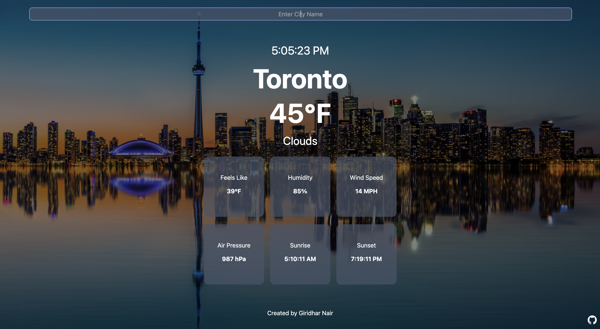

# Weather-App




## Introduction
This is a simple responsive weather application created using Vite + React, Tailwind CSS, Google Image Search API, and OpenWeatherMap API. </br>

## Run Locally
Clone the project
```bash
  git clone https://github.com/SyntaxWarrior30/Weather-App
```
Go to the project directory
```bash
  cd Weather-App
```
Install dependencies
```bash
  npm install
```
Rename `.env.exmaple` to `.env` and input your Google Search Engine ID & Google API key. </br>
```
VITE_CX={Your Google Search Engine ID}
VITE_API_KEY={Your Google API key}
VITE_WEATHER_KEY={Your OpenWeather API Key}
```
Run the development server
```bash
  npm run dev
```

